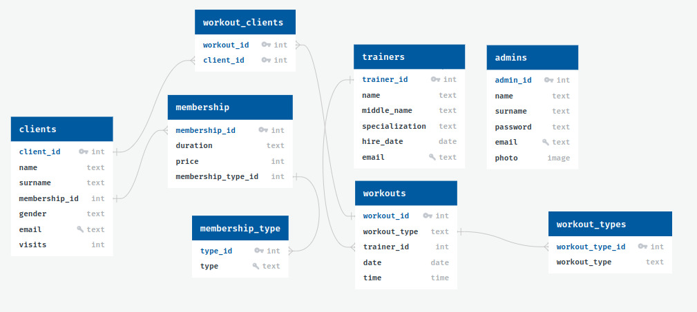

# Система управления клиентами тренажерного зала

## 📋 Описание проекта
**Система управления клиентами тренажерного зала** — это приложение для автоматизации процессов работы фитнес-клуба. Проект позволяет администраторам управлять клиентами, тренировками и расписанием, а также вести учет сотрудников. Простая в использовании программа помогает сократить затраты времени на рутинные задачи и повысить эффективность работы.

---

## 🚀 Функционал
### 1. **Управление клиентами**
- Добавление, редактирование и удаление данных клиентов.
- Отображение информации о текущих абонементах.

### 2. **Работа с тренировками**
- Создание, редактирование и удаление расписания тренировок.
- Назначение тренеров и участников для каждой тренировки.
- Визуальное отображение списка тренировок.

### 3. **Управление администраторами**
- Добавление новых администраторов с загрузкой фотографий.
- Хранение данных о логине, пароле и других сведений.

### 4. **Авторизация**
- Функция входа в систему для защиты данных.

### 5. **Навигация**
- Удобное главное меню с кнопками для перехода между разделами.

---

## 🛠️ Используемые технологии
- **Язык программирования**: Python
- **GUI**: PyQt6
- **База данных**: SQLite
- **Дополнительные библиотеки**: os, base64 для работы с изображениями.

---

## ER-диаграмма базы данных

